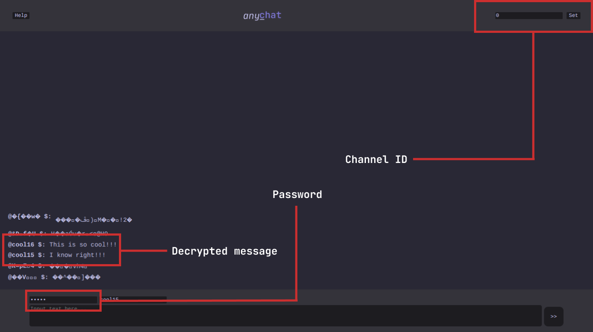

# 

A fun little messaging app that does not require login :)

#### Built using:
 

 <br>


___

### Features

- Real time messaging
- (That's lowkey it)

### How does it work?

Instead of logging in, you encrypt your own messages. 
- You get into a ***Room*** (Channel Id)
- You communicate with ***your own language*** (Password)
- And only those who knew the **Password** can read your messages.



### How do I use it?

1. Input a **Channel Id** (can be ***anything***)
2. Input a **Password** (make sure you remember it!)
3. Input a **Username** (optional)
4. Send a **message**!

### ⇓ Try it here! ⇓
> <a href="https://chat.anypost.dedyn.io"> anyChat </a> 
> (a bit laggy because I don't have a good server hoster ;-;)

___

### Can I run it locally?

<b> Absolutely! </b>, you can run this site as a local messaging app for your friends and family on the same network!

You can start by cloning the repository onto your homeserver or just your own computer!

    Prerequisites:
    - NodeJS
    - npm

#### Steps:

1. Clone the repository.
    ```bash
    git clone https://github.com/coolNaN16/anyChat anyChat
    ```

2. Run `npm install` on the anyChat directory.

3. Run `node scripts/clear_db.js` on the anyChat directory to clear the db file.

4. Run `node index.js` also on the anyChat directory.

5. Visit `localhost:8080` on a web browser.

6. Aaandd done!

___
<span style="color: red;">

### WARNING

**DO NOT SEND ANY PERSONAL INFORMATION TO ANYONE, THE SECURITY OF THIS SITE IS NOT STRONG, AND YOUR MESSAGES CAN BE DECRYPTED EASILY.**

</span>

